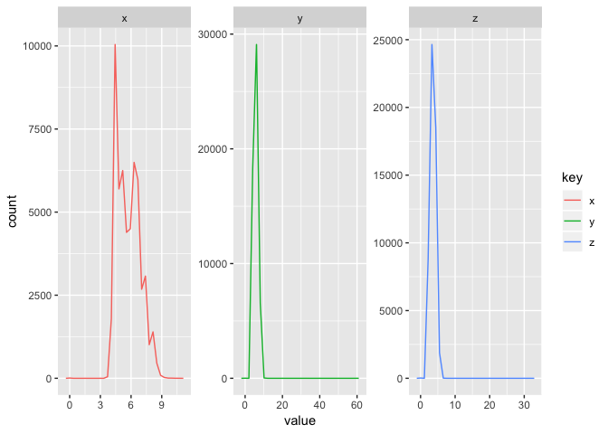
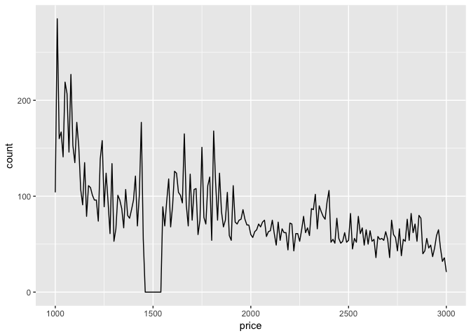
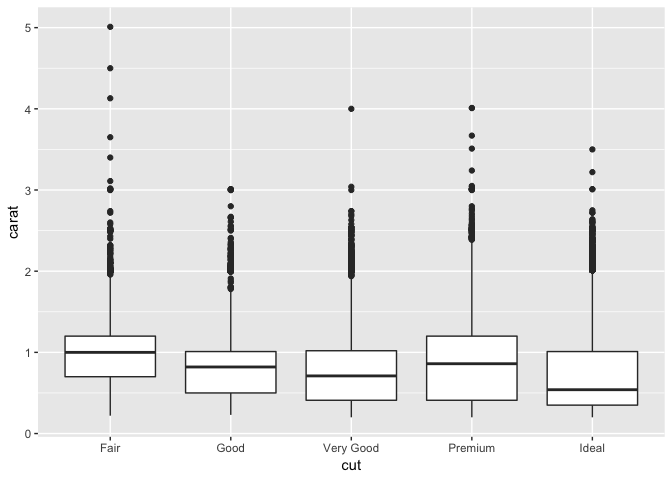

Exploratory Data Analysis
================
Samantha Toet
8/23/2018

Intro
-----

From [7. Exploratory Data Analysis](http://r4ds.had.co.nz/exploratory-data-analysis.html)

*Ch.5 in the printed copy*

Install required packages and sample datasets:

``` r
knitr::opts_chunk$set(echo = TRUE)
library(tidyverse)
ggplot2::diamonds
library(nycflights13)
data(flights)
library(viridis)
```

EDA is used to investigate the quality of your data, and to develop an understanding of how your data works. It is generally a cyclical process:

1.  Generate questions about data
2.  Search for answers by visualising, transforming, and modelling the data
3.  Use what you learned to refine the questions
4.  Repeat

Two types of questions that will always be useful for making discoveries within your data:

1.  What type of *variation* occurs within my variables?
2.  What type of *covariation* occurs between my variables?

Let's refresh on some terms:

-   **Variable**: quantity, quality, or property that you can measure (can be **categorical**, **continuous**)
-   **Value**: state of the variable when you measure it
-   **Observation**: set of measurements made under similar conditions containing several values, each associated with a different variable (EX. a data point)
-   **Tabular data**: set of values, each associated with a variable and an observation (ideally *tidy*, with each value placed in its own “cell”, each variable in its own column, and each observation in its own row)

Variation
---------

**Variation** is the tendency of the values of a variable to change from measurement to measurement. The best way to understand the pattern of variation is to visualise the distribution of the variable’s values.

#### Visualizing Distributions

**Categorical** variables (factors, character vectors) can only take one of a small set of values. To examine the distribution of a categorical variable, use a **bar chart** where the height of the bars corresponds to the number of observations (`dplyr::count()`)

**Continuous** variables (numbers, datetimes) can take any of an infinite set of ordered values. To examine the distribution of a continuous variable, use a **histogram**. A histogram divides the x-axis into equally spaced bins and then uses the height of a bar to display the number of observations that fall in each bin.

More on visualizing continuous variables: - set the width of the intervals in a histogram with `binwidth`, which is measured in the units of the x variable - play around with this to see how it changes. For example:

``` r
# large binwidth and all data:
ggplot(diamonds) +
  geom_histogram(mapping = aes(x = carat), binwidth = 0.5)
```


``` r
# smaller binwidth and subset of data:
smaller <- diamonds %>% 
  filter(carat < 3)
ggplot(data = smaller, mapping = aes(x = carat)) +
  geom_histogram(binwidth = 0.1)
```


-   use `geom_freqpoly()` instead of `geom_histogram()` when overlaying multiple histograms on the same plot. For example:

``` r
ggplot(data = smaller, mapping = aes(x = carat, colour = cut)) +
  geom_freqpoly(binwidth = 0.1)
```


#### What to look for in variation plots?

When looking at bar charts and histograms, ask yourself:

-   Which values are the most common? Why?
-   Which values are rare? Why? Does that match your expectations?
-   Can you see any unusual patterns? What might explain them?

Do understand subgroups, or clusters of your data, ask:

-   How are the observations within each cluster similar to eachother?
-   How are the observations in separate clusters different from another?
-   How can you explain or describe the clusters?
-   Why might the appearance of clusters be misleading?

What about *outliers*?

When you have a lot of data, it can be hard to see outliers in a histogram. The only evidence of outliers is the unusually wide limits on the x-axis. Use `coord_cartesian()` and adjust the `xlim()` and `ylim()` values to see these outliers. You can then pluck them out with dplyr and dig even deeper.

### Practice

**1.) Explore the distribution of each of the `x`, `y`, and `z` variables in `diamonds`. What do you learn? Think about a diamond and how you might decide which dimension is the length, width, and depth.**

``` r
?diamonds
```

-   `x` is the length of the diamond in mm (1-10.74)
-   `y` is the width of the diamond in mm (1-58.9)
-   `z` is the depth of the diamond in mm (0-31.8)

**Answer**: see investigations below:

``` r
# length (x) distribution:
ggplot(diamonds, mapping = aes(x = x)) +
    geom_histogram(binwidth = 1) +
    coord_cartesian(ylim = c(0, 300)) # looks like some odd values
```


``` r
diamonds %>%
    filter(x < 3 | x > 10) %>%
    select(price, x, y, z) %>%
    arrange(x)
```

    ## # A tibble: 13 x 4
    ##    price     x     y     z
    ##    <int> <dbl> <dbl> <dbl>
    ##  1  4954   0    6.62  0   
    ##  2  5139   0    0     0   
    ##  3  6381   0    0     0   
    ##  4 12800   0    0     0   
    ##  5 15686   0    0     0   
    ##  6 18034   0    0     0   
    ##  7  2130   0    0     0   
    ##  8  2130   0    0     0   
    ##  9 15984  10.0  9.94  6.31
    ## 10 15223  10.0  9.94  6.24
    ## 11 15223  10.1 10.1   6.17
    ## 12 18531  10.2 10.2   6.72
    ## 13 18018  10.7 10.5   6.98

A majority of the diamonds have a length between 4 - 10mm. The diamonds that have a length of 0mm are clearly a mistake or they don't exist, and the diamonds that have a length greater than 10mm are quite expensive which seems to make sense.

``` r
# width (y) - this is the example used in the text:
ggplot(diamonds, mapping = aes(x = y)) +
    geom_histogram(binwidth = 0.5) +
    coord_cartesian(ylim = c(0, 100))
```


``` r
diamonds %>%
    filter(y < 3 | y > 30) %>%
    select(price, x, y, z) %>%
    arrange(y)
```

    ## # A tibble: 9 x 4
    ##   price     x     y     z
    ##   <int> <dbl> <dbl> <dbl>
    ## 1  5139  0      0    0   
    ## 2  6381  0      0    0   
    ## 3 12800  0      0    0   
    ## 4 15686  0      0    0   
    ## 5 18034  0      0    0   
    ## 6  2130  0      0    0   
    ## 7  2130  0      0    0   
    ## 8  2075  5.15  31.8  5.12
    ## 9 12210  8.09  58.9  8.06

A majority of the diamonds have a width between 5 - 10mm. The diamonds that have a width of 0 are clearly a mistake or they don't exist, and the two diamonds with very high widths (31.8mm and 58.9mm) must be mistakes because diamonds that big must cost hundreds of thousands of dollars, however these don't.

``` r
# depth (z) distribution:
ggplot(diamonds, mapping = aes(x = z)) +
    geom_histogram(binwidth = 1) +
    coord_cartesian(ylim = c(0, 100))
```


``` r
diamonds %>%
    filter(z < 1 | z > 9) %>%
    select(x, y, z, price, carat, cut) %>%
    arrange(desc(z))
```

    ## # A tibble: 21 x 6
    ##        x     y     z price carat cut      
    ##    <dbl> <dbl> <dbl> <int> <dbl> <ord>    
    ##  1  5.12  5.15  31.8  1970  0.51 Very Good
    ##  2  6.55  6.48   0    3142  1    Premium  
    ##  3  6.66  6.6    0    3167  1.01 Premium  
    ##  4  6.5   6.47   0    3696  1.1  Premium  
    ##  5  6.5   6.47   0    3837  1.01 Premium  
    ##  6  7.15  7.04   0    4731  1.5  Good     
    ##  7  0     6.62   0    4954  1.07 Ideal    
    ##  8  0     0      0    5139  1    Very Good
    ##  9  6.88  6.83   0    5564  1.15 Ideal    
    ## 10  0     0      0    6381  1.14 Fair     
    ## # ... with 11 more rows

Most of the diamonds have a depth between 2 and 7mm. The diamonds that have a depth of zero are most likely mistakes and there is one other outlier that appears to be a error with a depth of 31.8mm.

Let's look at x, y, and z together:

``` r
without_unusual <- diamonds %>%
    filter(x > 3 | x < 10, y > 3 | y < 30, z > 1 | z < 9)

# Numerical distribution of each variable
diamonds %>%
  count(cut_width(x, 5))
```

    ## # A tibble: 3 x 2
    ##   `cut_width(x, 5)`     n
    ##   <fct>             <int>
    ## 1 [-2.5,2.5]            8
    ## 2 (2.5,7.5]         50404
    ## 3 (7.5,12.5]         3528

``` r
diamonds %>%
  count(cut_width(y, 5)) # x and y are similar (excluding weird outliers in y)
```

    ## # A tibble: 5 x 2
    ##   `cut_width(y, 5)`     n
    ##   <fct>             <int>
    ## 1 [-2.5,2.5]            7
    ## 2 (2.5,7.5]         50455
    ## 3 (7.5,12.5]         3476
    ## 4 (27.5,32.5]           1
    ## 5 (57.5,62.5]           1

``` r
diamonds %>%
  count(cut_width(z, 5)) # z is smaller than x and y --> probably the depth
```

    ## # A tibble: 4 x 2
    ##   `cut_width(z, 5)`     n
    ##   <fct>             <int>
    ## 1 [-2.5,2.5]          724
    ## 2 (2.5,7.5]         53214
    ## 3 (7.5,12.5]            1
    ## 4 (27.5,32.5]           1

``` r
# Side by side histograms:
diamonds %>%
    gather(key = "key", value = "value", x:z) %>% # gather into short form for ggplot
    ggplot(mapping = aes(x = value, color = key)) +
    geom_freqpoly() +
    facet_wrap(~key, scales = "free") 
```

    ## `stat_bin()` using `bins = 30`. Pick better value with `binwidth`.



``` r
# Looks like y and z have fairly similar curves (right skew) while x is more distributed with a peak at only 10k


# Overlaying:
diamonds %>%
    gather(key = "key", value = "value", x:z) %>% # gather into long form for ggplot so that x:z are all in one column titled key
    ggplot(mapping = aes(x = value, color = key)) + 
    geom_freqpoly(binwidth = 0.1) +  # where's x (length)?
    ylim(0, 3000) + # limit y axis to zoom in - assuming lg values are outliers
    xlim(0, 15)  # limit x axis to zoom in - assuming lg values are outliers
```


``` r
# Here it looks like x (length) and y (width) are correlated 
```

When plotted as histograms side by side, it looks like y (length) and z (depth) have fairly similar curves and higher peak values while x is slightly more distributed with a peak at only 10k. However when plotted over top of another, y (length) and x (width) appear to be correlated. The second plot makes more sense, because length and width are generally related for diamond shapes (there are no long, skinny diamonds) and similarly, depth is usually the smallest variable.

**2.) Explore the distribution of `price`. Do you discover anything unusual or surprising? (Hint: Carefully think about the `binwidth` and make sure you try a wide range of values.)**

``` r
ggplot(diamonds, mapping = aes(x = price)) +
    geom_freqpoly(binwidth = 10) +
    xlim(1000, 3000)
```

    ## Warning: Removed 38103 rows containing non-finite values (stat_bin).

    ## Warning: Removed 2 rows containing missing values (geom_path).



**Answer**: there are no diamonds that cost around $1500. <span style="color:blue">Why?</span>

**3.) How many diamonds are 0.99 carat? How many are 1 carat? What do you think is the cause of the difference?**

``` r
#distribution
diamonds %>%
  filter(carat < 3) %>%
  ggplot(aes(x = carat)) +
  geom_histogram(bins = 200)
```


``` r
# 0.99 carat:
diamonds %>%
    filter(carat == .99) %>% 
    nrow() # there are 23 diamonds
```

    ## [1] 23

``` r
# 1 carat:
diamonds %>%
    filter(carat == 1) %>%
    nrow() # there are 1558 diamonds
```

    ## [1] 1558

``` r
# 1.01 carat:
diamonds %>%
    filter(carat == 1.01) %>%
    nrow() # there are 2242 diamonds
```

    ## [1] 2242

**Answer**: there are 23 diamonds that are .99 carats, 1,558 diamonds that are 1 carat, and 2,242 that are 1.01 carats. It seems that making a diamond just under a popular carat size is not a good idea. I suspect that it because you cannot sell a .99 carat diamond as a 1 carat diamond, but you can sell a 1.01 carat diamond as a 1 carat. Close but under does not sell!

**4.) Compare and contrast `coord_cartesian()` vs `xlim()` or `ylim()` when zooming in on a histogram. What happens if you leave `binwidth` unset? What happens if you try and zoom so only half a bar shows?**

``` r
# Using coord_cartesian() and previous carat example:
ggplot(diamonds) +
    geom_histogram(mapping = aes(x = carat)) + # binwidth not set
    coord_cartesian(xlim = c(0.95, 1.05))
```

    ## `stat_bin()` using `bins = 30`. Pick better value with `binwidth`.


``` r
# This looks wierd. When we don't set a binwidth, ggplot assigns one based on the number of bins (30) and gives a warning message ("pick better value"). In this case the binwidth is greater than the x limits so we'll only see one bar. 

# Set the binwidth to something more appropriate:
ggplot(diamonds) +
    geom_histogram(mapping = aes(x = carat), binwidth = .01) +
    coord_cartesian(xlim = c(0.95, 1.05))
```


``` r
# That looks much better. 

# The same plot, but using xlim():
ggplot(diamonds) +
    geom_histogram(mapping = aes(x = carat), binwidth = .01) + # binwidth not set
    xlim(0.95, 1.05)
```

    ## Warning: Removed 47617 rows containing non-finite values (stat_bin).

    ## Warning: Removed 1 rows containing missing values (geom_bar).


``` r
# This time, it looks like ggplot removed 47617 rows before plotting that did not fit within the xlim range. 
```

**Answer**: `xlim()` and `ylim()` change the axis limits and drop data observations that don't fall within the limit (so it won't keep half a bar) while `coord_cartesian()` keeps all observations. <span style = "color:blue" These two plots look different because coord_cartesian does not delete the observations that are at the limits of the plot while xlim deletes them </span>

Interestingly, when setting the number of bins, the plots produced by coord\_cartesian and xlim will be different from each other in a different way than above.

``` r
# Using coord_cartesian(), 400 bins, and limits of 0 and 3:
diamonds %>%
  ggplot(aes(x = carat)) +
  geom_histogram(bins = 400) +
  coord_cartesian(xlim = c(0, 3))
```


``` r
# Using xlim(), 400 bins, and limits of 0 and 3:
diamonds %>%
  ggplot(aes(x = carat)) +
  geom_histogram(bins = 400) +
  xlim(0, 3)
```

    ## Warning: Removed 32 rows containing non-finite values (stat_bin).

 **Answer**: `xlim()` and `ylim()` change the axis limits and drop data observations that don't fall within the limit while `coord_cartesian()` keeps all observations. <span style = "color:blue" These two plots look different because coord_cartesian calculates the bins using all the data while xlim calculates the bins on the data inside the xlimits </span>

Missing Values
--------------

Replace unusual values with missing values(`NA`'s) using `mutate()` and `ifelse()`. For example:

``` r
diamonds2 <- diamonds %>%
    mutate(y = ifelse(y < 3 | y > 20, y, NA))
```

This way, ggplot won't plot those variables, but they're not lost forever.

### Practice

**1.) What happens to missing values in a histogram? What happens to missing values in a bar chart? Why is there a difference?**

``` r
# Plot histogram of x (continuous variable):
diamonds %>%
    mutate(x = ifelse(x < 3 | x > 10, NA, x)) %>%
    ggplot(aes(x = x)) +
    geom_histogram()
```

    ## `stat_bin()` using `bins = 30`. Pick better value with `binwidth`.

    ## Warning: Removed 13 rows containing non-finite values (stat_bin).


``` r
# Note warning message saying it removed the 13 rows containing NAs

# Plot bar chart of cut (discrete variable) after creating some missings:
diamonds %>%
    mutate(cut = ifelse(cut == "Fair", NA, cut)) %>%
    ggplot(aes(x = cut)) +
    geom_bar()
```

    ## Warning: Removed 1610 rows containing non-finite values (stat_count).


``` r
# Note warning message saying 1610 rows were removed
# Also, the character variable has been changed into numeric in the mutate line. If you don't want that to happen, set as.character in the mutate line:
diamonds %>%
    mutate(cut = ifelse(cut == "Fair", NA, as.character(cut))) %>%
    ggplot(aes(x = cut)) +
    geom_bar()
```


**Answer**: histograms are for binning continuous variables and bar charts are for binning discrete variables. They both remove `NA` variables before plotting. If you set `na.rm` to `TRUE`, the values are removed silently (i.e. without warning).

**2.) What does `na.rm = TRUE` do in `mean()` and `sum()`?**

``` r
?mean
?sum
```

**Answer**: `na.rm = TRUE` is a logical value indicating whether `NA` values should be stripped before the computation proceeds.

Covariation
-----------

**Covariation** describes the behavior *between* variables. It describes the tendency for the values of two or more variables to vary together in a related way.

The best way to spot it is to visualize the relationship between two variables, which depends on the type of variables.

#### A Continuous Variable Broken Down By A Categorical Variable

Instead of displaying count (`geom_freqpoly()`) on the y-axis use **density** (`..density..`), which is the count standardised so that the area under each frequency polygon is one.

Another option is to use a **boxplot**: - box from 25th percentile of the distribution to the 75th percentile (IQR) - a line in the middle of the box representing the *median* - points represent values that are 1.5 times the IQR from the edge of the box - line, or *whisker* extends from each end of box to furthest non-outlier point

Many categorical variables don’t have such an intrinsic order, so you might want to `reorder()` them to make a more informative display.

`cood_flip()` is helpful for long variable names.

### Practice

**1.) Use what you’ve learned to improve the visualisation of the departure times of cancelled vs. non-cancelled flights.**

``` r
flights %>% 
    mutate(cancelled = is.na(dep_time)) %>% # TRUE if cancelled 
    ggplot(aes(x = sched_dep_time)) +  
    geom_density() + # density plot of sched dep time 
    facet_wrap(~cancelled) # compare
```


**Answer**: it looks like there are more flights cancellations at the end of the day. Maybe when flights get too delayed (i.e. too late for the pilots to fly) they are cancelled? Also assuming that planes make multiple trips per day, if one flight is delayed all subsequent flights will also be delayed.

**2.) What variable in the diamonds dataset is most important for predicting the price of a diamond? How is that variable correlated with cut? Why does the combination of those two relationships lead to lower quality diamonds being more expensive?**

``` r
# Compare carat and price:
ggplot(diamonds, aes(x = carat, y = price)) +
    geom_point() +
    geom_smooth()
```

    ## `geom_smooth()` using method = 'gam' and formula 'y ~ s(x, bs = "cs")'


``` r
# Looks like price and carat are positively related, with a spike around 2.5 carats. Bigger diamonds cost more. 

# Does the size of the diamond influence cut?
ggplot(diamonds, aes(x = cut, y = carat)) +
    geom_boxplot()
```



``` r
# Fair diamonds (the lowest quality) seem to have the largest size. 

# Compare cut and price:
ggplot(diamonds, aes(x = cut, y = price)) +
    geom_boxplot()
```


``` r
# Fair diamonds also seem to be slightly more expensive as well. 
```

**Answer**: weight, or `carat`, seems to be the most influential variable on price. So larger diamonds may be less ideal in quality, but they're still more expensive.

**3.) Install the `ggstance` package, and create a horizontal boxplot. How does this compare to using `coord_flip()`?**

``` r
library(ggstance)

# Using stat_boxploth from ggstance:
ggplot(diamonds, aes(x = price, y = cut)) +
    stat_boxploth()
```


``` r
# Using coord_flip:
ggplot(diamonds, aes(x = cut, y = price)) + # swapped x and y 
    geom_boxplot() +
    coord_flip()
```


**Answer**: they create very similar plots, however one requires you to change the axis assignments.

**4.) One problem with boxplots is that they were developed in an era of much smaller datasets and tend to display a prohibitively large number of “outlying values”. One approach to remedy this problem is the letter value plot. Install the `lvplot` package, and try using `geom_lv()` to display the distribution of `price` vs `cut`. What do you learn? How do you interpret the plots?**

``` r
library(lvplot)

ggplot(diamonds, aes(x = cut, y = price)) +
    geom_lv()
```


``` r
# I think lv breaks the data into several bins (each corresponding to a letter) and then plots the density in each bin. You can specify the number of bins using k = # (but I am not sure how the k is counted)
ggplot(diamonds, aes(x = cut, y = price)) +
    geom_lv(k = 3)
```


``` r
ggplot(diamonds, aes(x = cut, y = price)) +
    geom_lv(k = 5)
```


``` r
ggplot(diamonds, aes(x = cut, y = price)) +
    geom_lv(k = 10)
```


**Answer**: overall, letter value plots are to reduce over calling of outliers in larger data sets (n &gt; 10k) and reduce the number of points marked as outliers.

**5.) Compare and contrast `geom_violin()` with a facetted `geom_histogram()`, or a coloured `geom_freqpoly()`. What are the pros and cons of each method?**

``` r
# Violin plot:
ggplot(diamonds, aes(x = cut, y = carat)) +
    geom_violin()
```


``` r
# Violin plots show the distribution of cut in a mirrored density curve

# Faceted geom histogram: 
ggplot(diamonds, aes(x = carat)) +
    geom_histogram() +
    facet_wrap(~cut, scales = "free")
```

    ## `stat_bin()` using `bins = 30`. Pick better value with `binwidth`.


``` r
# Kind of hard to see comparisons

# Colored geom freqpoly:
ggplot(diamonds, aes(x = carat, color = cut)) +
    geom_freqpoly()
```

    ## `stat_bin()` using `bins = 30`. Pick better value with `binwidth`.


**Answer**: violin plots are helpful for viewing the distribution of cut in a mirrored density curve, while colored `geom_freqpoly()` is a better use for comparing distrubutions on top of the other. Faceted histograms can be useful for viewing comparisons side-by-side, however they can be difficult to read if there are more than 4 and the scales may be quite different.

**6.) If you have a small dataset, it’s sometimes useful to use `geom_jitter()` to see the relationship between a continuous and categorical variable. The `ggbeeswarm` package provides a number of methods similar to `geom_jitter()`. List them and briefly describe what each one does.**

``` r
library(ggbeeswarm)

# Using geom_quasirandom and mpg (smaller dataset):
ggplot(mpg, aes(x = cyl, y = hwy)) +
    geom_quasirandom()
```


``` r
# Looks like a violin plot made up of points

# Using geom_beeswarm (with mpg, a smaller dataset:
ggplot(mpg, aes(x = cyl, y = hwy)) +
    geom_beeswarm()
```


**Answer**: there are two primary methods:

-   `geom_quasirandom()` produces plots that are a mix of jittered and violin plots. It shows the density via width and is similar to jitter in that overalpping points are dodged.

-   `geom_beeswarm()` produces a plot similar to a violin plot, but offsets the points slightly.

#### Comparing Two Categorical Variables

To visualise the covariation between categorical variables, you’ll need to count the number of observations for each combination. There are ways to compute this.

-   `geom_count()`: the size of each circle in the plot represents how many observations occurred at each combination
-   compute `count()` with dplyr, then visualize with `geom_tile()` and the `fill()` aesthetic

If the categorical variables are unordered, you might want to use the `seriation` package to simultaneously reorder the rows and columns in order to more clearly reveal interesting patterns.

### Practice

**1.) How could you rescale the count dataset above to more clearly show the distribution of cut within colour, or colour within cut?**

``` r
# Count dataset:
counts <- diamonds %>% 
    count(color, cut)
    
# Add proportional summary value and better color palette
counts %>%
    group_by(color) %>%
    mutate(total = sum(n),
           prop = n / total) %>%
    ggplot(aes(x = color, y = cut, fill = prop)) +
    geom_tile() +
    scale_fill_viridis() #install and load viridis package for this to work
```


**Answer**: to clearly show the distribution of cut within color, calculate a new variable, `prop`, which is the proportion of each `cut` within a `color`, and then plot as a tile.

**2.) Use `geom_tile()` together with dplyr to explore how average flight delays vary by destination and month of year. What makes the plot difficult to read? How could you improve it?**

``` r
# To avoid wonky calculations, let's only work with non-cancelled flights (from transforming section):
not_cancelled <- flights %>% 
    filter(!is.na(dep_delay), !is.na(arr_delay))

# Plot it using geom_tile and dplyr:
not_cancelled %>% group_by(dest, month) %>%
    summarise(avg_delay = mean(dep_delay)) %>%
    ggplot(aes(month, dest, fill = avg_delay)) +
    geom_tile()
```


``` r
# Yikes, that's pretty ugly

# Shrink dataset to only include top 10 destinations:
top_dest <- not_cancelled %>% group_by(dest) %>%
    count(sort = T) %>% .[1:10,] 

# Plot again: 
not_cancelled %>% filter(dest %in% top_dest$dest) %>% # top 10 dests
    group_by(dest, month) %>% # filter by month and day
    summarise(avg_delay = mean(dep_delay)) %>% # avg dep delay
    ggplot(aes(month, dest, fill = avg_delay)) +
    geom_tile() + # plot it
    scale_fill_viridis() # make it pretty
```


**Answer**: in the original plot, there are 105 destinations. That can be very difficult to visualize. If we narrow down the number of destinations to only the top 10 we get more informative (and interpretable!) data. Also viridis is a better color palette for visualizing tile plots.

**3.) Why is it slightly better to use `aes(x = color, y = cut)` rather than `aes(x = cut, y = color)` in the example above?**

**Answer**: there are more levels in the color variable (7) than there are in the cut variable (5). Because most screens are wider than they are long, it's generally recommended to put the variable with more factors on the x-axis.

#### Comparing Two Continuous Variables

The best way to view covariation between two variables is by plotting a scatterplot (`geom_point()`) and observing the patterns of points.

The more points in a scatterplot the greater the chance of overplotting. This can be fixed by adjusting the `alpha` aesthetic for transparency.

Another option is to `bin` your data: - `geom_bin2d()` divides the coordinate plane into 2d buns and then uses a fill color to display how many point fall into each bin - *rectangular bins* - `geom_hex()` does the same as `geom_bin2d`, however it created *hexagonal bins* - bin one continuous variable so it acts like a categorical variable, then display using a boxplot and `cut_width(x, width)` (divides x into bins of width `width`) or `cut_number()` (display approximately the same number of points in each bin)

### Practice

**1.) Instead of summarising the conditional distribution with a boxplot, you could use a frequency polygon. What do you need to consider when using `cut_width()` vs `cut_number()`? How does that impact a visualisation of the 2d distribution of carat and price?**

**Answer**: both `cut_width()` and `cut_number()` split the variable into groups, however for `cut_width()` we need to specify the width, or the bin size, and with `cut_number()` we need to specify the number of bins. Selecting the appropriate numbers or widths of bins is always important - too large and you might loose important data, too small and you might miss out on trends.

**2.) Visualise the distribution of carat, partitioned by price.**

``` r
diamonds %>% 
    mutate(facets = cut_number(price, 3)) %>% # cut price into 3 intervals
    ggplot(aes(x = carat)) + # plot it
    geom_freqpoly(aes(color = facets)) + # color = one of 3 price intervals
    xlim(0,2.5)
```

    ## `stat_bin()` using `bins = 30`. Pick better value with `binwidth`.

    ## Warning: Removed 126 rows containing non-finite values (stat_bin).

    ## Warning: Removed 6 rows containing missing values (geom_path).


**Answer**: see above output. <span style="color:blue">Is there a better way to label facet in the legend?</span>.

Yes, using the cut function and the labels argument, you can label the categories

``` r
diamonds %>% 
    mutate(priceCAT = cut(price, 3, labels = c("Cheap", "Medium", "Expensive"))) %>% # cut price into 3 labeled intervals
    ggplot(aes(x = carat)) + # plot it
    geom_freqpoly(aes(color = priceCAT)) + # color = one of 3 price intervals
    xlim(0,2.5)
```

    ## `stat_bin()` using `bins = 30`. Pick better value with `binwidth`.

    ## Warning: Removed 126 rows containing non-finite values (stat_bin).

    ## Warning: Removed 6 rows containing missing values (geom_path).


Another possible answer discretizes price using boxplots

``` r
diamonds %>%
  ggplot(aes(x = price, y = carat)) + 
  geom_boxplot(aes(group = cut_width(price, 1000)))
```


**3.) How does the price distribution of very large diamonds compare to small diamonds? Is it as you expect, or does it surprise you?**

I chose to only include diamonds up to 3 carats in this analysis, so maybe that does not answer the question about "very large" diamonds...

``` r
diamonds2 <- diamonds %>%
  filter(carat < 3) %>%
  mutate(size = cut(carat, breaks = c(0, 0.5, 1, 1.5, 2, 2.5, 3), labels = c(1:6)))

diamonds2 %>%
  ggplot(aes(x = price)) + 
  geom_density(aes(color = size, fill = size)) +
  facet_wrap(~ size)
```


**Answer** Diamonds of small size are most often low price no matter the shape, color, or quality. The width of price distribution gets wider as size increases. Diamonds above 1.5 carats have more price variability than smaller diamonds.

**4). Combine two of the techniques you’ve learned to visualise the combined distribution of cut, carat, and price. **

Again, the below plot is only for diamonds up to 3 carats

``` r
ggplot(diamonds2, aes(x = size, y = price, fill = cut)) +
  geom_boxplot()
```


